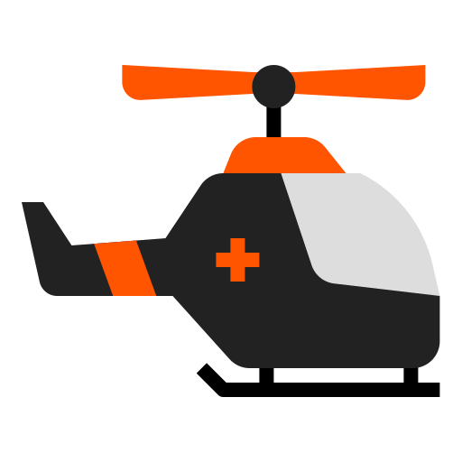
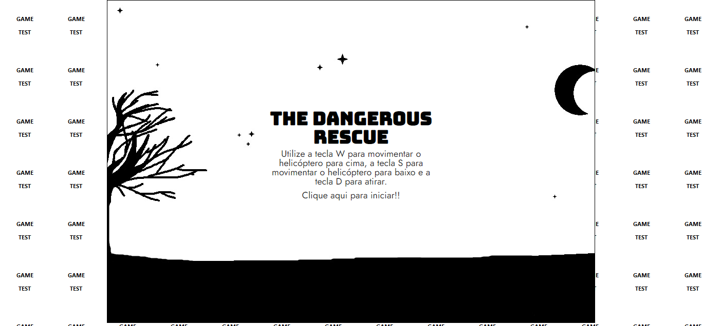
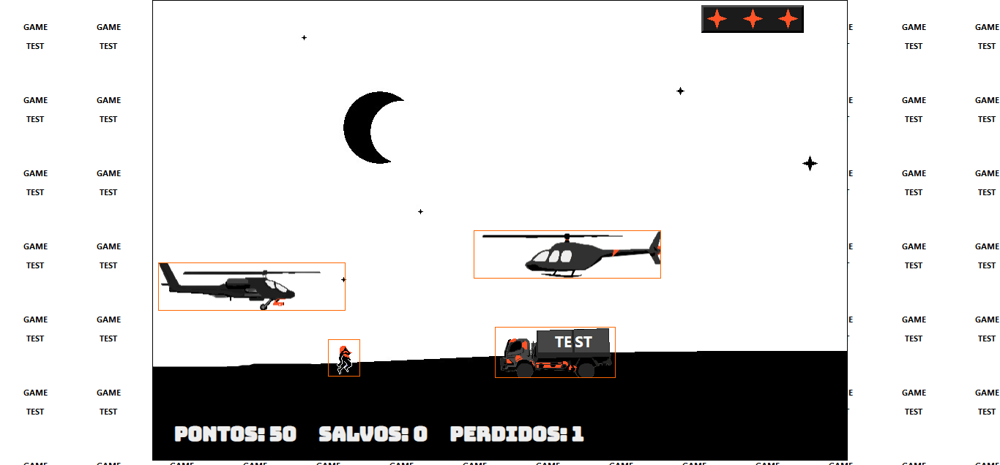
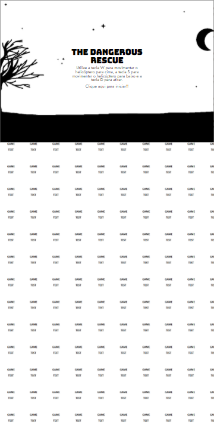
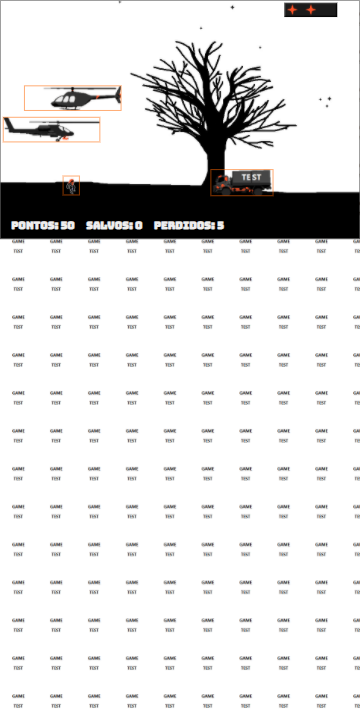
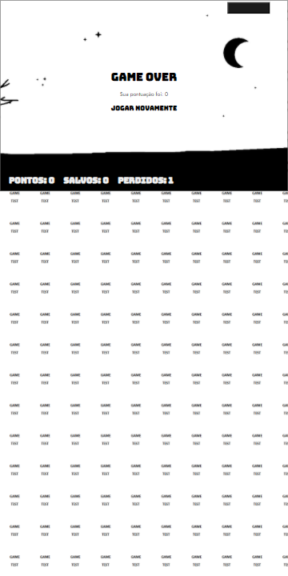

<h4 align="center">
  <br>
    
</h4>
<p align="center">
  
  
  <a href="https://github.com/NyctibiusVII/TheDangerousRescue-AirWar/blob/master/LICENSE">
    
  </a>
  <a href="https://picpay.me/Matheus_nyctibius_vii">
  
  </a>
</p>
<p align="center">
  <a href="#TheDangerousRescue-AirWar-">Projeto</a>&nbsp;&nbsp;&nbsp;|&nbsp;&nbsp;&nbsp;
  <a href="#tecnologias-">Tecnologias</a>&nbsp;&nbsp;&nbsp;|&nbsp;&nbsp;&nbsp;
  <a href="#layout-">Layout</a>&nbsp;&nbsp;&nbsp;|&nbsp;&nbsp;&nbsp;
  <a href="#licença-%EF%B8%8F">Licença</a>
</p>

# TheDangerousRescue-AirWar 🏃🏻‍♂️🚁
Projeto desenvolvido para a conclusão do curso **Construindo o seu primeiro jogo de naves**. @DigitalInnovationOne.


## Tecnologias 🚀
Esse projeto foi desenvolvido com as seguintes tecnologias:

- [Html](https://pt.wikipedia.org/wiki/HTML)
- [Css](https://pt.wikipedia.org/wiki/Cascading_Style_Sheets)
- [Javascript](https://pt.wikipedia.org/wiki/JavaScript)
- [Jquery](https://jquery.com/)

## Layout 🚧
#### Desktop Screenshot
<div>
<!-- Responsive, 1366 x 768, 50% (Lenovo Ideapad 310)-->
   
   
</div>

#### Mobile Screenshot
<div>
<!-- Responsive, 360 x 720, 50% (Moto G6 Play)-->
   
   
   
</div>

##### Obs: As bordas estão ativas para melhorar a nossa identificação da colisão como programadores. caso queira retirar basta ir ./styles/index.css, linha 167 na parte " /* Collision visualization */ " e remover.

### Como jogar? 🕹
Você controla um helicóptero e seu objetivo é salvar seu parceiro e ganhar o máximo de pontos possíveis ô salvando e destruindo os inimigos pela frente.
*Conforme voce vai avançando a dificuldade aumenta!*

#### Requisitos 😦
<!-- - Ter um dispositivo com o tamanho **minimo** de 950 x 630-->
- Acesso a um teclado

#### Regras 🧩
**Objetivo claro**: Salve seu parceiro e sobreviva o máximo que puder!

**Movimentação**: Você só consegue se movimentar para cima e para baixo.

**Salvamento**: Basta encostar seu helicóptero no personagem quando ele estiver passando para ele subir.
*+1 save*.

**Ataque**: Para atirar utilize a tecla 'seta para a direita →', basta um projétil para a destruição do inimigo.
*helicóptero inimigo: +100 pontos, caminhão: +50 pontos*.

**Colisões corpo a corpo**: O jogador perde -1 ponto de energia de (3) se colidir com o inimigo. No caso de seu parceiro se ele colidir com o inimigo ele é morto e o jogador tem que esperar seu renascimento.

**Vida**: O jogador tem vidas(energia), e só pode colidir 2 vezes com inimigo para sobreviver. *A terceira você perde...*

**Fim?**: Não existe fim até que voçê perca.

#### Desktop 💻✔
Helicóptero controlado por 'setinhas': cima ↑, direita → e baixo ↓. Cima e Baixo são para movimentação e Direita para atirar.

Disponível em breve no formato 'W, S, A, D'.

#### Mobile 📱❌
*Não disponível*

## Rodando o projeto 🚴🏻‍♂️
#### "Só vou dar uma olhadinha...":
  <a href="https://the-dangerous-rescue-air-war.vercel.app/">🚁 Site hospedado na Vercel 🚁</a>

#### Na sua maquina:

```bash

# Clone o repositório
$ git clone https://github.com/NyctibiusVII/TheDangerousRescue-AirWar.git

# Acesse a pasta do projeto no seu console
$ cd TheDangerousRescue

# Para executar o projeto basta abrir o html com seu navegador.
```

### BUG 🐞
1 Bug conhecido: Quando você atira ao mesmo tempo que seu helicóptero esta colidindo com o inimigo(frente a frente), a animação da explosão 'buga' e fica um sprite infinito na sua tela.

//imagem

*Por enquanto a resolução para esse problema é recarregar a pagina.*

### OBS 👀
Esse projeto esta aqui para você brincar, aprender e modificar ao seu estilo gamer/programador. É um projeto pequeno mas ainda sim é ótimo para quem é iniciante começar a fuçar e modificar as coisas. Diverta-se 🎮

## Contribuição 💭
Para construir essa aplicação tive a ajuda do professor **Denilson Bonatti** da DigitalInnovationOne que disponibilizou video aulas do projeto **"Construindo o seu primeiro jogo de naves"**.

Se você esta querendo ajudar no projeto não deixe se 'forka', fazer suas alterações e dar pull 🎉. Eu ja agradeço muito por você esta aqui visualizando e lendo isso... Obrigado 🧡

## Licença ⚖️
Este projeto está sob a licença do MIT. Veja o arquivo [LICENSE](https://github.com/NyctibiusVII/TheDangerousRescue-AirWar/blob/master/LICENSE) para mais detalhes.

## Contato ✉️
| <br><sub><a href="https://www.instagram.com/nyctibius_vii/?hl=pt-br">@MatheusVidigal🦊</a></sub> |
| :---: |

<p align="left">
   <a href="https://www.linkedin.com/in/matheus-vidigal-nyctibiusvii/">
      
   </a>
   <a href="https://mail.google.com/mail/u/1/#inbox?compose=GTvVlcSGLCKpKJfwPsKKqzXBplKkGtCLvCQcFWdWxCxQFfkHzzjVkgzrMFPBgKBmWFHvrjrCsMqSH">
      
   </a>
</p>